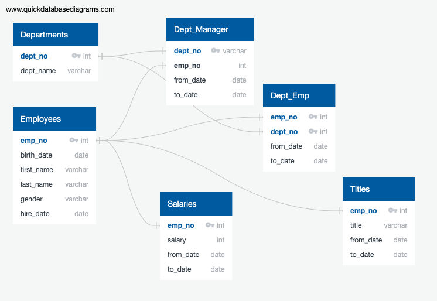

# Pewlett-Hackard-Analysis

## Overview
Using a fictional company's employee data, this analysis helps the company plan for retiring employees and a plan for elgibility of a proposed mentorship program. There are an expected (X) number of employees eligible for retirement in the upcoming years - a [%] portion of the workforce. This analysis will help the company plan ahead for these changes and suggest possible solutions to minimize the business impact on employees transitioning out of the workforce.

## Results
The Entity Relationship Diagram helps visualize the relationship between the disparate data sources.  By joining datasets using SQL queries, I could build custom tables for each part of the analysis.

Bulleted list with 4 major points from the two analysis deliverables
### The Number of Retiring Employees by Title
Total current employees. Employees elegible for retirement. What %?

The first table needed holds the titles of employees who were born between Jan 1952-Dec 1955. As employees moved up through the ranks and recieved promotions throughout the years, the data needed to be cleaned for distinct titles to eliminate duplicate employee records. 

How many employees are expected to retire? - X -  link to file: retirement_titles.csv(Data/retirement_titles.csv)
 - due to promotions - some duplicates. using DISTINCT ON joins I was able to get the Unique titles - X - link to file: unique_titles.csv(Data/unique_titles.csv)
Retiring titles X Retiring_titles.csv (Data/retiring_titles.csv) - what roles will the team need to focus on backfilling and which areas will feel the largest impact of the upcoming retirements
 - 25916	Senior Engineer
 - 24926	Senior Staff
 - 9285	Engineer
 - 7636	Staff
- 3603	Technique Leader
- 1090	Assistant Engineer
- 2	Manager

### Employees Eligible for the Mentorship Program
Mentorship-eligibility - X of employees (Data/mentorship_eligibility.csv)

how many employees are eligible?

## Summary 
The summary addresses the two questions:
How many roles will need to be filled as the "silver tsunami" begins to make an impact? (XXXXX)
Are there enough qualified, retirement-ready employees in the departments to mentor the next generation of Pewlett Hackard employees? (XXXXXX, no only X are eligble to partipcate in a mentorship program)
two additional quieries or tables that may provide more insight
-look into a month - by month view to see which seasons, business quarters, etc. may feel the most impact

Hiring, Staffing, Plan to recruit more talent and promote existing. 
